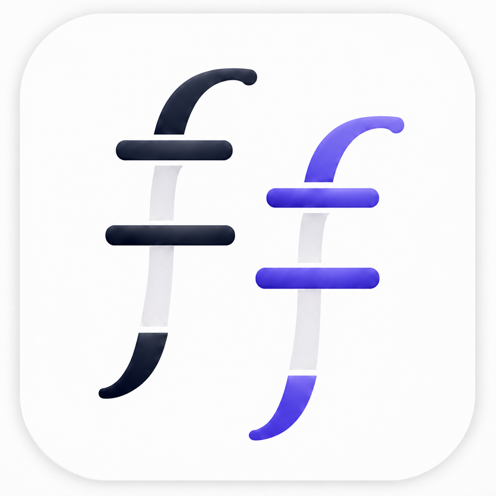

<p align="center">
  
</p>

<h1 align="center">FigForge</h1>

<p align="center">
  A browser-based scientific figure workspace for fast, structured labeling of
  Western blots, gels, and other lane-based images.
</p>

> **Beta:** This repository contains FigForge `0.13.0-beta.1`. Keep the original
> scientific images and download `.figforge` checkpoints regularly. Please report
> problems through [GitHub Issues](https://github.com/mmccoy-01/figforge/issues).

## What FigForge does

FigForge combines a non-destructive image canvas with a spreadsheet-like label
grid. It is designed for figures containing up to 30 lanes.

- Import PNG, JPEG, and TIFF source images. TIFF files retain their original data
  while using a browser-safe preview for editing.
- Move, resize, fit, crop, reset, and delete images without changing the source
  file. Undo and redo cover image deletion.
- Align 1–30 uniform lane guides by dragging the outer boundaries.
- Add label rows above or below an image and paste tabular data from Excel or
  Google Sheets.
- Navigate cells with the keyboard; format, merge, and unmerge rectangular ranges
  horizontally or vertically.
- Apply alignment, font styling, rotation, borders, row height, and vertical
  border extensions toward the image.
- Start without an image to create a reusable lane-label template.
- Download and reopen portable `.figforge` projects containing the layout and
  copies of the immutable source assets.
- Export publication output as PNG, TIFF, or PDF at 300 or 600 DPI.

Lane guides, selection outlines, resize handles, and the editing background are
never included in publication exports.

## Quick start

FigForge requires Python 3.11 or newer.

### Windows PowerShell

```powershell
py -3.11 -m venv .venv
.venv\Scripts\Activate.ps1
python -m pip install --upgrade pip
python -m pip install -r requirements.txt
shiny run --reload app.py
```

### macOS or Linux

```bash
python3.11 -m venv .venv
source .venv/bin/activate
python -m pip install --upgrade pip
python -m pip install -r requirements.txt
shiny run --reload app.py
```

Open the local URL printed by Shiny, normally <http://127.0.0.1:8000>.

Developers can install the editable package and test dependencies instead:

```bash
python -m pip install -e ".[dev]"
pytest
```

## Basic workflow

1. Upload a PNG, JPEG, or TIFF image, or choose **Start without image**.
2. Set the lane count and align the temporary lane guides.
3. Add label rows above or below the image.
4. Enter values directly or paste cells copied from a spreadsheet.
5. Select ranges to merge cells or apply text and border formatting.
6. Choose **Download project** to create a durable `.figforge` checkpoint.
7. Use **Export** to render a clean PNG, TIFF, or PDF figure.

Use **Open project** to resume a downloaded project or template. A template made
without an image preserves its labels and formatting when the first image is
attached later.

## Saving and browser recovery

A `.figforge` download is the durable, portable project format. It keeps
schema-versioned figure state separate from copies of the original source images;
imported assets are validated again when the project is reopened.

On Posit Connect Cloud, FigForge also caches the current draft and source images
in IndexedDB in the same browser profile. After a refresh or expired server
session, the **Restore draft** banner can rebuild the project in a new Shiny
session. The recovery indicator reports success only after the state and all
referenced source images are present in the browser.

Browser recovery is a convenience layer, not permanent cloud storage. It does
not follow the user to another browser or device and can disappear if site data
is cleared, private browsing is used, or storage is evicted. Download `.figforge`
checkpoints at meaningful milestones.

The header **Save** action marks the active session draft as saved. It is not a
substitute for **Download project** on Connect Cloud.

## Deploy to Posit Connect Cloud

This repository is ready for GitHub-based deployment:

1. Push the repository to GitHub.
2. In Connect Cloud, choose **Publish** and select the repository and branch.
3. Select Shiny for Python and use `app.py` as the primary file.
4. Enable automatic republishing on push if desired.
5. Deploy, then test upload, browser recovery, `.figforge` download/reopen, and
   each export format at the public URL.

`requirements.txt` contains the runtime dependencies Connect Cloud needs.
FigForge defaults to portable-project mode, so runtime worker files are never
presented as permanent user storage. No database configuration is required.

See [Deployment and persistence](docs/DEPLOYMENT.md) for the release checklist,
configuration details, and an important distinction between Posit Connect Cloud
deployment and Posit Cloud code-project export. The current official publishing
workflow is documented by [Posit Connect Cloud](https://docs.posit.co/connect-cloud/user/publish/01-new.html).

## Beta limitations

- The editor is desktop-first and currently requires a viewport at least 940 px
  wide; mobile editing is not supported.
- Lane widths are uniform. The left and right lane-region boundaries are
  adjustable, but individual internal boundaries are not yet editable.
- TIFF editing uses the first frame as the display preview.
- There is no account system, shared project library, cloud database, or
  server-side revision history.
- Browser recovery is same-browser and same-deployment-origin only.
- Quantification is intentionally outside this beta's scope.

## Project layout

```text
app.py                         Shiny application and server entry point
figforge/                      Models, persistence, export, and UI modules
figforge/static/               Browser JavaScript, CSS, and app artwork
data/                          Local runtime data (ignored by Git)
docs/                          Deployment, architecture, and beta test guides
tests/                         Automated model, persistence, export, asset, and UI tests
nextsteps.md                   Product roadmap and implementation history
```

## Documentation

- [Beta testing guide](docs/BETA_TESTING.md)
- [Deployment and persistence](docs/DEPLOYMENT.md)
- [Architecture and browser/server contract](docs/ARCHITECTURE.md)
- [Changelog](CHANGELOG.md)
- [Product roadmap](nextsteps.md)

## Brand assets

The simplified two-mark [`figforge-icon.png`](figforge/static/img/figforge-icon.png)
is the primary application icon and favicon. The original full gel-and-label
illustration remains available as
[`figforge-alt-logo.jpg`](figforge/static/img/figforge-alt-logo.jpg).

## Scientific-data handling

FigForge does not overwrite uploaded source images. Image placement and cropping
are stored as transforms, and export is rendered from the immutable source asset.
Even so, this is beta software: verify every exported figure against the source
data before publication and retain independent copies of all originals.

## Feedback

For a beta problem report, include the FigForge version, browser and operating
system, the action being performed, the expected result, and steps that reproduce
the issue. Do not attach unpublished or sensitive scientific images to a public
issue; use a synthetic or redacted example instead.
